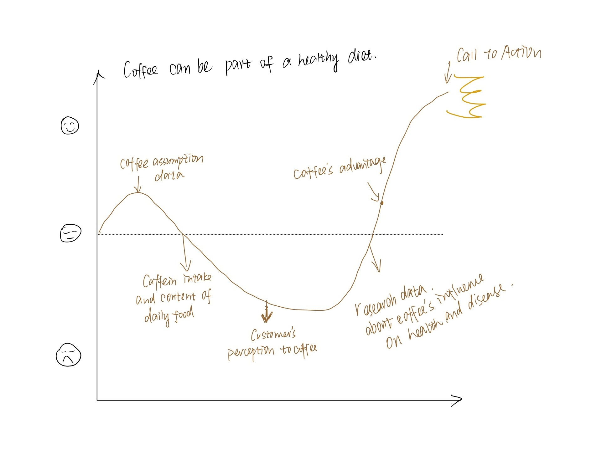
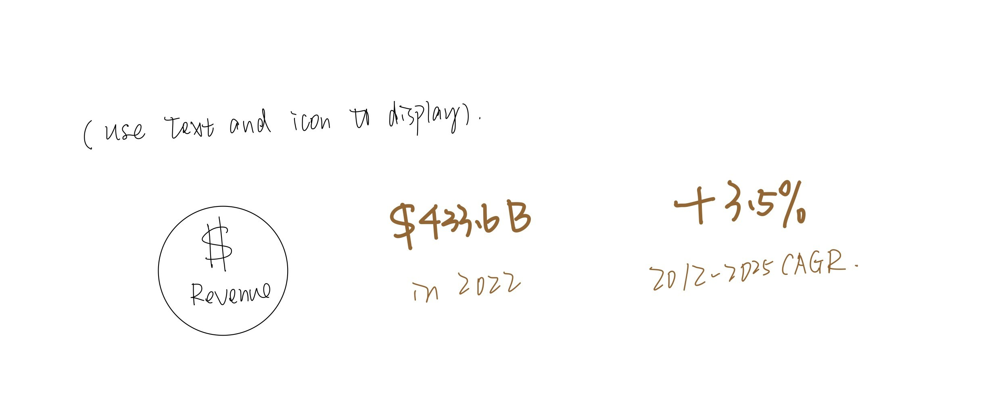
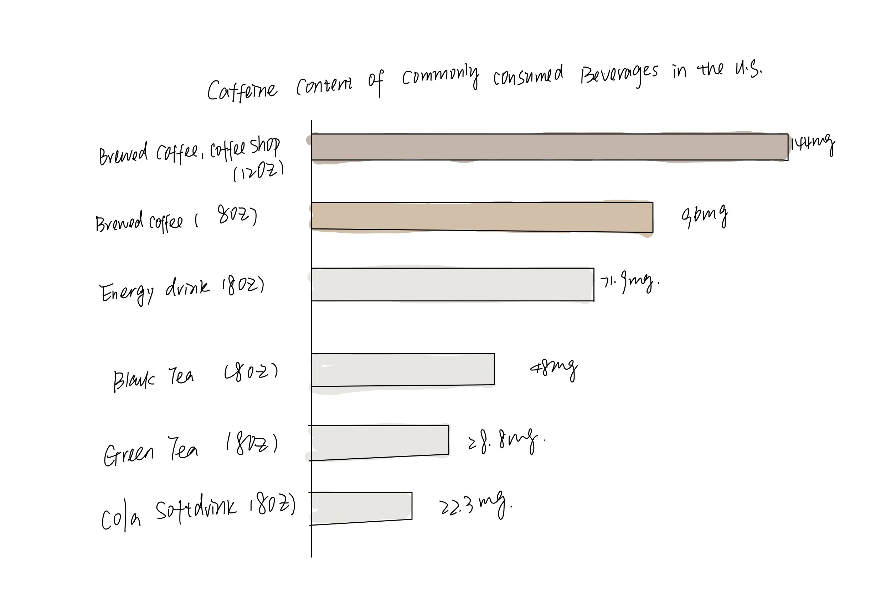
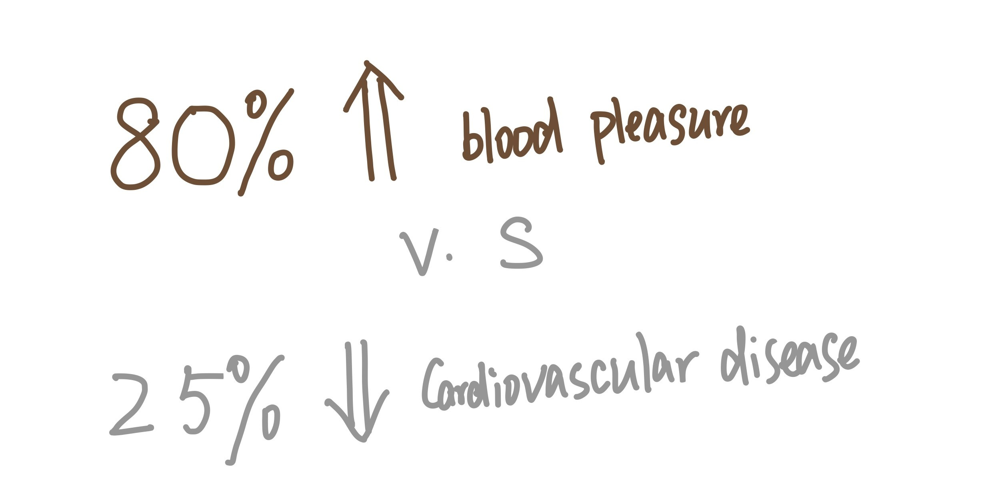

# Final Project - COFFEE AND HEALTH
## Final Project Index
[Final Part Ⅰ](Final-Project-One.md)  
[Final Part Ⅱ](Final-Project-Two.md)  
[Final Part Ⅲ](Final-Project-Three.md)  
[Back to Portfolio](README.MD)  

## Outline 📑
### Executive Summary 📝
According to statistics on coffee consumption, between 30 and 40 percent of people worldwide drink coffee daily. And in the United States, this statistic is even higher, at 66%. Coffee consumption reached a 20-year high, according to data from the National Coffee Association (NCA) 2022 report. When we are exhausted from studying, coffee may give us energy, and it may also be a useful social tool. Whatever the case, we must acknowledge that coffee consumption is rising worldwide and has risen to the top of the list of non-alcoholic beverages.  

Even so, there is persistent worry when people discuss coffee about the negative effects of caffeine and worries that it might cause severe health issues. Recent research, however, suggests that coffee is healthier than it is harmful.  

This project will focus on the health effects of coffee. I will begin by analyzing the consumption trends of coffee before exploring the relationship between coffee and health and whether it contributes to certain diseases. In order for everyone to fully comprehend the advantages of coffee and the standards for healthy coffee consumption, this project seeks to dispel some false perceptions about coffee by offering data support.  

### Project Structure 🗺️	
**_Topic:_**  
Take Caffeine Concerns Less Seriously, coffee can be part of a healthy diet.  

**_Reader Perspective:_**  
As an adult with a coffee addiction, I am curious to know whether long-term coffee consumption is taxing and harmful to my body, as well as the ideal daily coffee intake so that I can keep my body healthy without giving up coffee.  

**_Call to Action:_**  
I can do this by drinking up to 400 milligrams of caffeine a day, roughly the amount of caffeine in 3 to 4 cups of coffee.  

### Story Arc :

The project will be divided into several stages:
1. Trend of offee consumption worldwide.
2. Caffein intake and content of daily food.
3. Customer's initial perceptions to coffee.
4. Coffee's effects on health and disease based on researches.
5. Coffee's could be part of the healthy diet.
6. Call to action: the moderate volume of daily coffee consumption.  

## Initial Sketches
### Stage 1: Trend of offee consumption worldwide
**_The popularity of coffee among global consumers is increasing year by year._**   

  
-> This chart shows an obvious increase of global coffee consumption in the last decade.  
[Data Source](https://www.statista.com/statistics/292595/global-coffee-consumption/)  

  
-> This visualizations show that coffee consumption is increasing year by year, and coffee has become the mainstream among hot drinks.  
[Data Source](https://www-statista-com.cmu.idm.oclc.org/outlook/cmo/hot-drinks/worldwide#revenue)  

  
-> I am also thinking of changing some charts into the text visualization to make numbers more obvious and cause resonance with audiences.  

<noscript></noscript><object class='tableauViz'  style='display:none;'><param name='host_url' value='https%3A%2F%2Fpublic.tableau.com%2F' /> <param name='embed_code_version' value='3' /> <param name='site_root' value='' /><param name='name' value='coffee_map&#47;Sheet1' /><param name='tabs' value='no' /><param name='toolbar' value='yes' /><param name='static_image' value='https:&#47;&#47;public.tableau.com&#47;static&#47;images&#47;co&#47;coffee_map&#47;Sheet1&#47;1.png' /> <param name='animate_transition' value='yes' /><param name='display_static_image' value='yes' /><param name='display_spinner' value='yes' /><param name='display_overlay' value='yes' /><param name='display_count' value='yes' /><param name='language' value='en-US' /><param name='filter' value='publish=yes' /></object>

                
  
 
-> This map shows the top 10 countries having the most coffee consumption in 2023. I have reservations about this visualization and am wondering if I should replace it with a column chart.  
[Data Source](https://worldpopulationreview.com/country-rankings/coffee-consumption-by-country)  

### Stage 2: Caffein intake and content of daily food
**_Caffeine is everywhere in our lives, but among these beverages, brewed coffee has the highest content. Therefore, it will cause people to worry about drinking coffee and consuming caffeine._**   
  
-> This chart shows caffeine content of commonly consumed beverages. We can see brewed coffee wins the first.  
[Data Source](https://fdc.nal.usda.gov/fdc-app.html#/?component=1057)  

### Stage 3: Customer's initial perceptions to coffee
**_Although many news have reported that coffee is not a great threat to health, most respondents still believe that coffee is harmful to the body._**   

<a href="https://infogram.com/6e6e3051-18dd-4f9c-981e-72a2eec5b7ec" style="color:#989898!important;text-decoration:none!important;" target="_blank">consumer perception</a> <a href="https://infogram.com" style="color:#989898!important;text-decoration:none!important;" target="_blank" rel="nofollow">Infogram</a>
  
 
-> This visualization shows respondents' original thoughts about the effects of coffee on their health in a research.

  
-> This text and data visualization shows that nearly 80% of respondents believed that drinking coffee would increase blood pressure. Only less than 25% of respondents believed that drinking coffee would decrease the risk of cardiovascular disease.  
[Data Source](https://www.ncbi.nlm.nih.gov/pmc/articles/PMC6471209/)  

### Stage 4: Coffee's effects on health and disease based on researches
**_Based on the research, we could come to a conclusion for the relationship between coffee and health._**   

<a href="https://infogram.com/25cc4def-0995-4927-85b9-3b22db7d4880" style="color:#989898!important;text-decoration:none!important;" target="_blank">research data</a> <a href="https://infogram.com" style="color:#989898!important;text-decoration:none!important;" target="_blank" rel="nofollow">Infogram</a>
  
 
-> This visualization represents that most of the current research shows that drinking coffee in moderation has no risk to health.  
[Data Source:](https://ift.onlinelibrary.wiley.com/doi/full/10.1111/1541-4337.12206?casa_token=Nu_sgxq6pXMAAAAA%3AYBW6O7PhTqH4cIg0Hmo1wG5pWO_CSPpCypI8nJMDMp8XbMsSV3W95Wp_7N_JpbSNe3dlyuzYu_Vq)  

### Stage 5: Coffee's could be part of the healthy diet.
**_Point out the theme of the project to increase the audience's attention and interest._**   

<a href="https://infogram.com/c4d2b26f-67c8-4237-a14b-bbe094e5ea8d" style="color:#989898!important;text-decoration:none!important;" target="_blank">Untitled dashboard</a> <a href="https://infogram.com" style="color:#989898!important;text-decoration:none!important;" target="_blank" rel="nofollow">Infogram</a>
  
 
-> This visualization represents moderate coffee assumption could decrease risks of certain diseases.  
[Data Source:](https://www.hsph.harvard.edu/nutritionsource/food-features/coffee/)  

### Stage 6: Call to action: the moderate volume of daily coffee consumption

<a href="https://infogram.com/653e88e4-06da-46b9-b1de-dbb66bdce20c" style="color:#989898!important;text-decoration:none!important;" target="_blank">Untitled dashboard</a> <a href="https://infogram.com" style="color:#989898!important;text-decoration:none!important;" target="_blank" rel="nofollow">Infogram</a>
  
 
-> This is the last part of the project, which is for calling to action. I hope to graphically illustrate the most appropriate amount of daily coffee consumption and caffeine intake for adults. I also hope to bring the audience the conclusion they want to know.  
[Data Source 1](https://nationalcoffee.blog/2017/05/04/nervous-about-caffeine-dont-be/)  
[Data Source 2](https://www.thieme-connect.com/products/ejournals/html/10.1055/s-0043-115007)

## Data Source 💬
**_list of data_**  
| Name and URL | Desceiption |  
| ------------- | ------------- |  
| [Statista: Coffee consumption worldwide from 2012/13 to 2020/21](https://www.statista.com/statistics/292595/global-coffee-consumption/)  | The specific data will be used to re-visualize and calculate the global coffee consumption growth rate.  |  
| [World Coffee Consumption Statistics](https://coffee-rank.com/world-coffee-consumption-statistics/)  | Data from the report and analysis of world coffee consumption trends will be used for report.  |  
| [Coffee consumption hits two-decade high - Spring 2022 National Coffee Data Trends report](https://www.ncausa.org/Newsroom/Coffee-consumption-hits-two-decade-high-2022-NCDT)  | Analysis and idea of USA coffee consumption will be used for report.  |  
| [Statista: Hot Drinks Consumer Markets Insights](https://www-statista-com.cmu.idm.oclc.org/outlook/cmo/hot-drinks/worldwide)  | Data of hot drinks revenues and volumes will be used for visualization.  |  
| [Coffee Consumption by Country 2023](https://worldpopulationreview.com/country-rankings/coffee-consumption-by-country)  | Data on the top 10 countries that drink the most coffee will be used for visualization.  |  
| [Caffeine Content of Beverages Data](https://fdc.nal.usda.gov/fdc-app.html#/?component=1057)  | The dataset will be used to make the visualization。  |  
| [Consumers’ Perceptions of Coffee Health Benefits and Motives for Coffee Consumption and Purchasing](https://www.ncbi.nlm.nih.gov/pmc/articles/PMC6471209/)  | A summary of consumer perception in the literature and survey data will be used.  |  
| [A Comprehensive Overview of the Risks and Benefits of Coffee Consumption](https://ift.onlinelibrary.wiley.com/doi/full/10.1111/1541-4337.12206?casa_token=Nu_sgxq6pXMAAAAA%3AYBW6O7PhTqH4cIg0Hmo1wG5pWO_CSPpCypI8nJMDMp8XbMsSV3W95Wp_7N_JpbSNe3dlyuzYu_Vq)  | The overall data in the table of studies on the relationship between coffee and disease in the literature will be used.  |  
| [Harvard: The nutrition Source_Coffee](https://www.hsph.harvard.edu/nutritionsource/food-features/coffee/)  | The data and ideas about the benefit of coffee will be cited.  |  
| [Nervous About Caffeine? Don’t Be.](https://nationalcoffee.blog/2017/05/04/nervous-about-caffeine-dont-be/)  | Provide inspiration for my topic, and data on caffeine intake will be used.  |  
| [The Impact of Coffee on Health](https://www.thieme-connect.com/products/ejournals/html/10.1055/s-0043-115007) | The data in the research will be used.  |  
| [Coffee Photos](https://www.pexels.com/search/coffee/) | The pictures of coffee will be used.  |  

Most of the data sources above will be used to analyze the data and redesign the visualization. Simultaneously, to better convey the correct suggestions to the audience, this project will refer to the ideas and conclusions of some research reports. The main background and inserted images will be from the previous website. If new and available data sources are discovered when the report is developing, they will be supplemented in due course.   

## Method and Medium ✈️
The final project will be presented using shorthand. The above charts will be drawn with Flourish, Tableau, Figma, Infogram and other data visualization tools, and will be displayed on the final web page. The first stage may be divided into two shorthand pages. Charts and data visualizations of other stages will be displayed on a separate page.  

