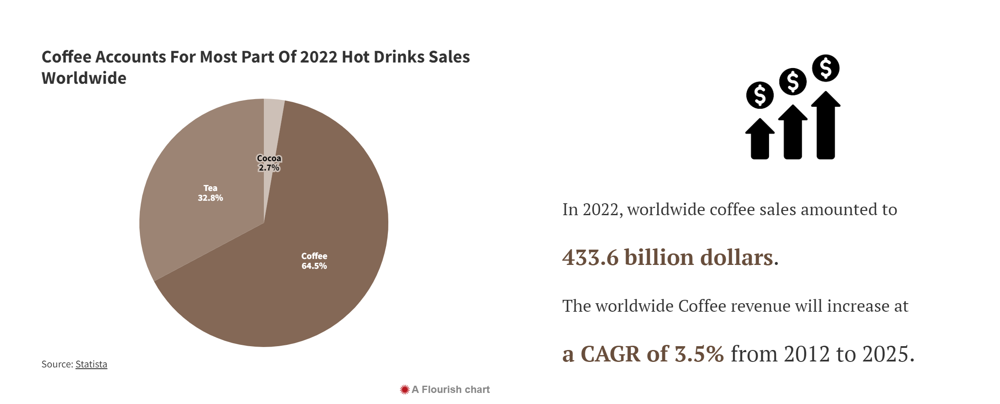
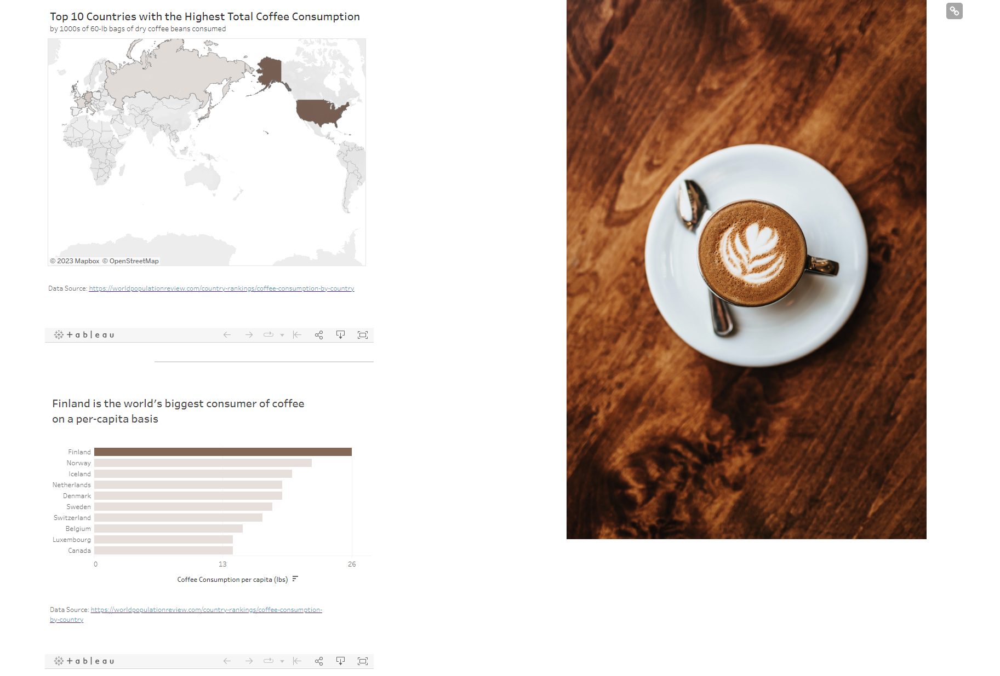

# Final Project - COFFEE AND HEALTH
## Final Project Part Ⅲ  
## Final Project Index
[Final Part Ⅰ](Final-Project-One.md)  
[Final Part Ⅱ](Final-Project-Two.md)  
[Final Part Ⅲ](Final-Project-Three.md)  
[Back to Portfolio](README.md)  

## Changes made since Part Ⅱ
**1. Title page:**  
I have changed the title of the final presentation from "Coffee and Health" to "Coffee can be part of a health diet". I wish I could draw the audience in with a headline that is more direct and explicit.  

**2. Part 1: Analyze coffee consumption trends**  
_Part 1.2_  
Given that I believe chart 1.2 is somewhat similar to the earlier consumption data and that I want to present the results with more understandable data, I changed the line chart of figure 1.2 into the form of text. In addition, I added the percentage unit for the pie chart.  

_**The previous charts are:**_  

<noscript></noscript><object class='tableauViz'  style='display:none;'><param name='host_url' value='https%3A%2F%2Fpublic.tableau.com%2F' /> <param name='embed_code_version' value='3' /> <param name='site_root' value='' /><param name='name' value='stage1_3&#47;Dashboard1' /><param name='tabs' value='no' /><param name='toolbar' value='yes' /><param name='static_image' value='https:&#47;&#47;public.tableau.com&#47;static&#47;images&#47;st&#47;stage1_3&#47;Dashboard1&#47;1.png' /> <param name='animate_transition' value='yes' /><param name='display_static_image' value='yes' /><param name='display_spinner' value='yes' /><param name='display_overlay' value='yes' /><param name='display_count' value='yes' /><param name='language' value='zh-CN' /></object>

                

 

 

**_After change:_**  

_Part 1.3_  

In this part, I changed the title of the map chart to "Top 10 Countries with the Highest Total Coffee Consumption". The title was changed to differentiate the meaning of the two visualizations.  

_**The previous charts are:**_  

<noscript></noscript><object class='tableauViz'  style='display:none;'><param name='host_url' value='https%3A%2F%2Fpublic.tableau.com%2F' /> <param name='embed_code_version' value='3' /> <param name='site_root' value='' /><param name='name' value='map1_16768502783020&#47;Dashboard1' /><param name='tabs' value='no' /><param name='toolbar' value='yes' /><param name='static_image' value='https:&#47;&#47;public.tableau.com&#47;static&#47;images&#47;ma&#47;map1_16768502783020&#47;Dashboard1&#47;1.png' /> <param name='animate_transition' value='yes' /><param name='display_static_image' value='yes' /><param name='display_spinner' value='yes' /><param name='display_overlay' value='yes' /><param name='display_count' value='yes' /><param name='language' value='zh-CN' /></object>

                

<noscript></noscript><object class='tableauViz'  style='display:none;'><param name='host_url' value='https%3A%2F%2Fpublic.tableau.com%2F' /> <param name='embed_code_version' value='3' /> <param name='site_root' value='' /><param name='name' value='stage1_2_16768499669510&#47;Dashboard1' /><param name='tabs' value='no' /><param name='toolbar' value='yes' /><param name='static_image' value='https:&#47;&#47;public.tableau.com&#47;static&#47;images&#47;st&#47;stage1_2_16768499669510&#47;Dashboard1&#47;1.png' /> <param name='animate_transition' value='yes' /><param name='display_static_image' value='yes' /><param name='display_spinner' value='yes' /><param name='display_overlay' value='yes' /><param name='display_count' value='yes' /><param name='language' value='zh-CN' /></object>

                

**_After change:_**  

## Final Project

### The audience

### Final design decisions

### References

## Final thoughts
