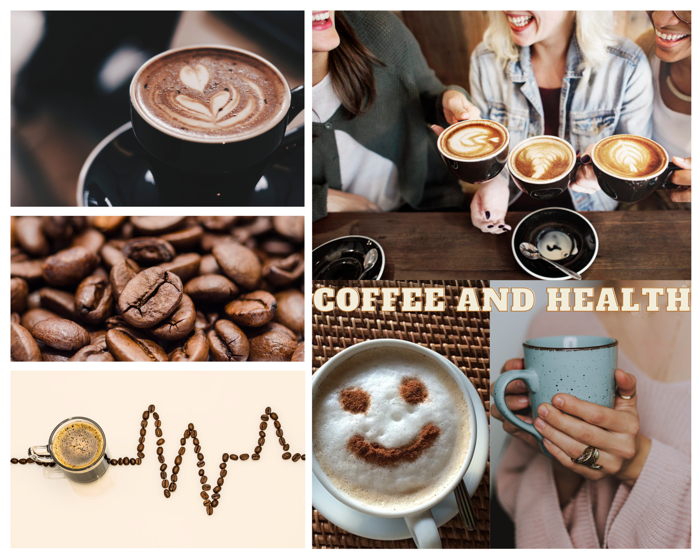

# Final Project - COFFEE AND HEALTH
## Final Project Part Ⅱ  
## Final Project Index
[Final Part Ⅰ](Final-Project-One.md)  
[Final Part Ⅱ](Final-Project-Two.md)  
[Final Part Ⅲ](Final-Project-Three.md)  
[Back to Portfolio](README.md)  

## Wireframes and Storyboards 📋
Topic Review: Take Caffeine Concerns Less Seriously, coffee can be part of a healthy diet.  
The data show that people have been drinking more coffee lately. For a long time, many people believed that coffee and caffeine would cause irreversible damage to the body.  According to new research, drinking coffee in moderation has no negative effects on the body and may even have some benefits. As a result, through data support, this project hopes to clarify this misunderstanding and tell the audience how much coffee they should drink every day.

### Part 1: Analyze coffee consumption trends ☕
In this section, I'd like to go over the current state of the coffee market from various perspectives.  

**_1.1: Global Coffee Consumption and Volume increased in the last decade._**  
According to the International Coffee Organization (ICO), three characteristics of coffee affect consumer attitudes towards coffee: the health effect, the drinking pleasure and the sustainability of the production. For us, coffee serves as a pick-me-up or a social tool. As a result, according to our perception, the number of people drinking coffee is increasing. And this perception corresponds to the actual data. This graph shows that global coffee consumption has increased by 13% over the last decade. At the same time, coffee production is clearly on the rise.  

<noscript></noscript><object class='tableauViz'  style='display:none;'><param name='host_url' value='https%3A%2F%2Fpublic.tableau.com%2F' /> <param name='embed_code_version' value='3' /> <param name='site_root' value='' /><param name='name' value='stage1_1_16763366096520&#47;Dashboard1' /><param name='tabs' value='no' /><param name='toolbar' value='yes' /><param name='static_image' value='https:&#47;&#47;public.tableau.com&#47;static&#47;images&#47;st&#47;stage1_1_16763366096520&#47;Dashboard1&#47;1.png' /> <param name='animate_transition' value='yes' /><param name='display_static_image' value='yes' /><param name='display_spinner' value='yes' /><param name='display_overlay' value='yes' /><param name='display_count' value='yes' /><param name='language' value='zh-CN' /><param name='filter' value='publish=yes' /></object>

                

 
[Data Source 1](https://www.statista.com/statistics/292595/global-coffee-consumption/)  
[Data Source 2](https://www.statista.com/outlook/cmo/hot-drinks/worldwide)  

**_1.2: Coffee has gradually surpassed tea as the most popular hot beverage over the world._**  
The two visualizations below will be combined to tell a story. The left side of the page will have the first visualization, and the right side will have the second visualization. According to the data from the pie chart, coffee now makes up 65% of all hot drinks consumed, making it the most popular hot beverage.  

The first visualization:  

<noscript></noscript><object class='tableauViz'  style='display:none;'><param name='host_url' value='https%3A%2F%2Fpublic.tableau.com%2F' /> <param name='embed_code_version' value='3' /> <param name='site_root' value='' /><param name='name' value='stage1_3&#47;Dashboard1' /><param name='tabs' value='no' /><param name='toolbar' value='yes' /><param name='static_image' value='https:&#47;&#47;public.tableau.com&#47;static&#47;images&#47;st&#47;stage1_3&#47;Dashboard1&#47;1.png' /> <param name='animate_transition' value='yes' /><param name='display_static_image' value='yes' /><param name='display_spinner' value='yes' /><param name='display_overlay' value='yes' /><param name='display_count' value='yes' /><param name='language' value='zh-CN' /></object>

                

 

The second visualization:  

 
[Data Source](https://www.statista.com/outlook/cmo/hot-drinks/worldwide)  

**_1.3: About coffee consumption in different countries._**  
At this point in the story, I'd like to go into more detail about the differences in coffee consumption between countries. As a result, these two sets of data are chosen, which may represent different meanings. We can see that the United States has the highest total coffee consumption in the world, but Finland has the highest per capita coffee consumption. Therefore, I used two visualizations here. The two visualizations will be shown together to tell a story.  

The first visualization:  

<noscript></noscript><object class='tableauViz'  style='display:none;'><param name='host_url' value='https%3A%2F%2Fpublic.tableau.com%2F' /> <param name='embed_code_version' value='3' /> <param name='site_root' value='' /><param name='name' value='map1_16768502783020&#47;Dashboard1' /><param name='tabs' value='no' /><param name='toolbar' value='yes' /><param name='static_image' value='https:&#47;&#47;public.tableau.com&#47;static&#47;images&#47;ma&#47;map1_16768502783020&#47;Dashboard1&#47;1.png' /> <param name='animate_transition' value='yes' /><param name='display_static_image' value='yes' /><param name='display_spinner' value='yes' /><param name='display_overlay' value='yes' /><param name='display_count' value='yes' /><param name='language' value='zh-CN' /><param name='filter' value='publish=yes' /></object>

                

 

The second Visualization:  

<noscript></noscript><object class='tableauViz'  style='display:none;'><param name='host_url' value='https%3A%2F%2Fpublic.tableau.com%2F' /> <param name='embed_code_version' value='3' /> <param name='site_root' value='' /><param name='name' value='stage1_2_16768499669510&#47;Dashboard1' /><param name='tabs' value='no' /><param name='toolbar' value='yes' /><param name='static_image' value='https:&#47;&#47;public.tableau.com&#47;static&#47;images&#47;st&#47;stage1_2_16768499669510&#47;Dashboard1&#47;1.png' /> <param name='animate_transition' value='yes' /><param name='display_static_image' value='yes' /><param name='display_spinner' value='yes' /><param name='display_overlay' value='yes' /><param name='display_count' value='yes' /><param name='language' value='zh-CN' /></object>

                

 
[Data Source](https://worldpopulationreview.com/country-rankings/coffee-consumption-by-country)  

### Part 2: Caffeine content in beverages ☕
I will only tell one story in this section to illustrate the fact that caffeine can be found in a variety of beverages. The information shows that 1 oz. of brewed coffee contains about 12mg of caffeine. We can make an estimation of the daily coffee consumption based on this data. The earlier call to action is set up by this story.  

<noscript></noscript><object class='tableauViz'  style='display:none;'><param name='host_url' value='https%3A%2F%2Fpublic.tableau.com%2F' /> <param name='embed_code_version' value='3' /> <param name='site_root' value='' /><param name='name' value='stage2_16768501121890&#47;Dashboard1' /><param name='tabs' value='no' /><param name='toolbar' value='yes' /><param name='static_image' value='https:&#47;&#47;public.tableau.com&#47;static&#47;images&#47;st&#47;stage2_16768501121890&#47;Dashboard1&#47;1.png' /> <param name='animate_transition' value='yes' /><param name='display_static_image' value='yes' /><param name='display_spinner' value='yes' /><param name='display_overlay' value='yes' /><param name='display_count' value='yes' /><param name='language' value='zh-CN' /><param name='filter' value='publish=yes' /></object>

                

 
[Data Source](https://fdc.nal.usda.gov/fdc-app.html#/?component=1057)  

### Part 3: Consumers’ initial perceptions on coffee ☕
This story aims to illustrate the fact that many consumers believe that coffee has harmful effects on the body, contrary to studies and surveys. The rise in coffee consumption appears to be at odds with this. Despite their skepticism, consumers continue to choose to drink coffee.  

<a href="https://infogram.com/6e6e3051-18dd-4f9c-981e-72a2eec5b7ec" style="color:#989898!important;text-decoration:none!important;" target="_blank">consumer perception</a> <a href="https://infogram.com" style="color:#989898!important;text-decoration:none!important;" target="_blank" rel="nofollow">Infogram</a>

 
[Data Source](https://www.ncbi.nlm.nih.gov/pmc/articles/PMC6471209/)  

### Part 4: A summary of the research on the relationship between coffee and health ☕
The third installment's conclusion marks the beginning of the story's turn. The general public has a negative perception of how coffee consumption affects health, but most studies indicate that this is not the case. Upending expectations can be effectively and powefully persuasive.  

 
[Data Source](https://ift.onlinelibrary.wiley.com/doi/abs/10.1111/1541-4337.12206?casa_token=Nu_sgxq6pXMAAAAA%3AYBW6O7PhTqH4cIg0Hmo1wG5pWO_CSPpCypI8nJMDMp8XbMsSV3W95Wp_7N_JpbSNe3dlyuzYu_Vq)  

### Part 5: Health benefits of drinking coffee ☕
The fifth part will gradually bring the story to a close. To help everyone shed their misconceptions about coffee, the visualization shows the possibility that coffee may lower the risk of contracting certain diseases.   

 
[Data Source](https://www.hsph.harvard.edu/nutritionsource/food-features/coffee/)  

### Part 6: Call to action - How many cups of coffee a day? ☕
The conclusion of the narrative is at this point, and the audience is called to pay attention to the importance of consuming coffee in moderation. Even though coffee can help some diseases, the right amount must be consumed. The recommended daily limit for caffeine is 400 milligrams. It is best to limit your coffee consumption to no more than five cups if you only drink it for the caffeine.  

<a href="https://infogram.com/7c190806-1617-4d66-ad28-e80d96fac98e" style="color:#989898!important;text-decoration:none!important;" target="_blank">Copy: call to action</a> <a href="https://infogram.com" style="color:#989898!important;text-decoration:none!important;" target="_blank" rel="nofollow">Infogram</a>

 
[Data Source](https://www.fda.gov/consumers/consumer-updates/spilling-beans-how-much-caffeine-too-much)  

## Moodboard 🖌️

Picture Source is listed in th Data Source Part.  

**About Color:**  
As shown in the moodboard, the storyboard's dominant hue will be a shade of brown that resembles coffee. In some visualizations, the colors green and red are used to denote the advantages and risks, respectively.  

## User Research and Overview 📝
**Topic:**
Take Caffeine Concerns Less Seriously, coffee can be part of a healthy diet.  

**Target Audience:**  
Coffee addicts and those who believe coffee is harmful to the body are the primary target audiences.  
This project's call to action is to inform the audience that drinking coffee in moderation may be beneficial to the body, and to clarify how many cups of coffee constitute a moderate consumption.  

**Approach to identifying representative individuals to interview:**  
The majority of my friends and family are coffee enthusiasts. People of different ages may have different perspectives on the relationship between coffee and health. As a result, in order to ensure the diversity of the respondents, I chose respondents of various ages, including those in their 70s, Millennials, and Gen-Z.
In addition, because men and women may have different perspectives on the health benefits of coffee, I interviewed both men and women.
In this way, I hope that the interviewees can provide me with feedback on this story from various perspectives.  

### Interview script

| Goal | Questions to Ask |
|------|------------------|
| Ensure the clarity of the story description of each part, and ensure that the story does not deviate from the topic.    |  Are the story descriptions for each section clear and relevant to the topic?                |
| Ensure the integrity of the story logic, allowing the audience to read the whole story smoothly and grasp the rhythm of the story.     |  Is the overall logic of the story clear enough to include a call to action?                |
| Research the degree of completion of visualization, especially the degree of completeness, truthfulness and perceptibility.     |  Which visualization or content do you think works well or is most appealing to you?                |
| Research the degree of completion of visualization, especially the degree of completeness, truthfulness and perceptibility.     |  Is each part's visualization clear in expressing what is intended to be conveyed? Is there something confusing?                |
| Find out what audiences think about the appeal of this story. Make sure the story can engage the audience and ensure the usefulness of the story.     |  Will you respond to the call to action after reading this story? Or how will this story inspire you?                |
| Find out if there are other issues that could be improved beyond the above.     | What else do you think could be improved?                |

 

### Interview and Findings

| **Questions**               | **Interview 1 (Female, Millennials, Data Analyst)** | **Interview 2 (Male, 70s, Banker)** | **Interview 3 (Female, Gen Z, Sofeware Developer)** |
|-------------------------|--------------------------------|-------------|-------------|
|  **Q1: Are the story descriptions for each section clear and relevant to the topic?** | Yes, I think each part has an obvious purpose, but part 5 is a bit unclear. Because I don't know if this percentage is to express the percentage by which drinking 2-3 cups of coffee a day may reduce the possibility of disease, or the percentage to which it is reduced.            |  The story in each part fits the theme very well, especially the choice of color and coffee matching, which is also very aesthetically pleasing, and I was very excited when I watched it.           |  I think each section has a clear point of view and fits well with the theme. Starting with the third point would appeal to me more.           |
|  **Q2: Is the overall logic of the story clear enough to include a call to action?**                       |  The overall logic is clear. But it might be better if part 2 and part 3 are swapped. It is equivalent to first showing the background that coffee is considered by the public to be unhealthy to the audience, and then pointing out that the culprit is not actually caffeine. Further discussing the fact that coffee is not harmful and can even reduce the likelihood of certain diseases. In this way, the call to action can be better.                              |  The logical line of the story is very clear. But in fact, the description of coffee trend in the first part may be too much, and it will distract me when it comes to part 1.3. Because I feel that the content of the description may be similar. The transition between Part 1 and part 2 is a bit jumpy, you can consider adding a part or changing the following order.           |  The story is clear enough that I would love to move on to find out what the next part is. Especially at the beginning, it tells the audience about the public's perception of coffee, and then there is a turning point to list the actual benefits of coffee. This was a shock to me.           |
|  **Q3: Which visualization or content do you think works well or is most appealing to you?**                       |    I like the visualization of the last call to action best. Because the content you want to express is very clear, and the tone is also consistent. I also like the visualization of consumer consumption, because it is different from my original cognition.                            |  I think the visualizations of part 2 and 6 work well, especially part 6. This pair of visualization is particularly clear and clear, which is very effective for call to action. Bold and enlarged fonts let me know right away what to emphasize.           |  I would find the map (part 1.3) more appealing to me. I would find this kind of visualization very novel, and I would want to explore the data and content on the graph, making me feel more involved.           |
|  **Q4: Is each part's visualization clear in expressing what is intended to be conveyed? Is there something confusing?**                       |   I think it's clear what all the visualizations are trying to convey. But if some details are adjusted as follows, it will be more visually friendly. For example, in the second visualization of 1.2, the data in the pie chart can be added with a percent sign to make it clearer. When I looked at the 1.3 visualization again, I was a little confused at first. I first saw that the United States has the most coffee consumption at first glance, but the next visualization did not see the United States until I saw per capita. So I thought the title could be changed to "Total Coffee" so it wouldn't be confusing.                             | Overall, the meaning of visual expression is clear. But I think the visualization of part 3 is not intuitive enough. Because there are too many icons, it will be very confusing. If possible, only 4 icons are placed in the total, and one of the icons is brown. Male and female can put 10 icons, three of the males are brown, and two of the females are brown. In this way, the visual impact on me will be more direct, and I think that few people think that coffee is good for the body. For part 5, I think the title needs to be clearer, the data and title now confuse me a bit.            |  Yes, I think visualization can express each little story more accurately. But part 4, for me to see three colors at once, would be a bit confusing. I think benefit and null effect can be combined, because what I want to emphasize here is that the proportion of risk is smaller. At the same time, you can change the color back to the brown color, which is more neutral. For part 6, it would be better to change on average to less than or up to. At the same time, the color of the lower 5 coffee cups can be lighter, so that people will not be mistaken to suggest 5 cups.           |
|  **Q5: Will you respond to the call to action after reading this story? Or how will this story inspire you?**                       |   Certainly! I would feel less worried about what my coffee intake would do to my body. And I will rest assured to drink two cups of coffee a day!                             |   When I see the call to action part, I suddenly feel relieved. Since I'm an avid coffee lover, I can drink 2-3 cups a day. I was worried at one point that my heart would be affected, but it looks like I can drink coffee in peace.          |  I will be affected by the last call to action. Although I like drinking coffee, my parents always tell me that drinking coffee is not good for my health. After seeing this story, I will convey to them that drinking coffee in moderation is not harmful to the body.           |
|  **Q6: What else do you think could be improved?**                       |   Overall, I think the title of the visualization can directly emphasize the point of view of the story and highlight the core points. For example, for a bar chart of caffeine content, the title can be "Caffeine actually exists in a large amount in non-coffee drinks", and the words "non-coffee drinks" can be bolded and the font size increased. You can also consider changing it to the same as the chart s color.                             |  I think green and red are a little obtrusive, and can be changed into coffee. Then the overall color will be more unified. Besides that, I think there is nothing else needed to be improved.           |   In addition to the above issues, I think maybe some colors need to be changed. Just like the color problem of part 4 mentioned just now, can the colors of some titles be changed to the same color system? For example, in the title of part 6, the two enlarged numbers may be changed to brown.          |

 

### Identified changes for Part III

| **Research synthesis**                       | **Anticipated changes for Part III**                                                |
|------------------------------------------|---------------------------------------------------------------------------------|
|  The overall logical order is relatively clear, but the transition of part 1 and part 2 can be modified. | The order of parts 2 and 3 can be adjusted, first give the public's awareness of the impact of coffee on health, and then suggest that caffeine may not be the culprit. This will have more impact. |
|  Some visualizations can explicitly show units without confusion.                                        |   For the pie chart of Part 1.2, a percentage symbol should be added, otherwise it may be mistaken for a quantity instead of a percentage.                                                                              |
|  The titles of some visualizations need to be changed to more clearly and directly convey the meaning of the story.                                        |  For the first map of 1.3, the title needs to be changed to "Top 10 countries with the highest total coffee consumption".  The title of Part 2 can be changed to "Caffeine actually exists in a large amount in non-coffee drinks".  The title of Part 5 was changed to "Moderate coffee may decrease the disease risk by".   The title of the second line of Part 6 is changed to "Up to 400 mg caffeine daily".                                        |
|  Some visualizations are not very intuitive and clear, and can be simplified.                                        |     For the visualization of Part 3, I will try to place 4 icons in the "total" and 10 icons in the female and male filters. This will make the display ratio clearer.  For Part 4, I will combine the two series of benefit and null effect into "Benefit & null effect" to compare with risk. In this way, it is clearer to express the theme of this part of the story "Most research shows that coffee is not harmful to the body".                  |
|  The colors of some visualizations can be adjusted.                                        |   For part 4, after adjusting according to the above questions, consider whether to continue to use brown colors instead of green and red.  For part 6, reduce the transparency of the fifth cup of coffee to avoid misunderstandings by the audience.    |

 

## Data Source 💬
**_list of data_**  

| Name and URL | Desceiption |
| ------------- | ------------- |
| [Statista: Coffee consumption worldwide from 2012/13 to 2020/21](https://www.statista.com/statistics/292595/global-coffee-consumption/)  | The specific data will be used to re-visualize and calculate the global coffee consumption growth rate.  |
| [World Coffee Consumption Statistics](https://coffee-rank.com/world-coffee-consumption-statistics/)  | Data from the report and analysis of world coffee consumption trends will be used for report.  |
| [Motives And Preferences For Coffee Consumption](https://sciencetrends.com/motives-and-preferences-for-coffee-consumption/)  | Data from ICO will be used for report.  |
| [Coffee consumption hits two-decade high - Spring 2022 National Coffee Data Trends report](https://www.ncausa.org/Newsroom/Coffee-consumption-hits-two-decade-high-2022-NCDT)  | Analysis and idea of USA coffee consumption will be used for report.  |
| [Statista: Hot Drinks Consumer Markets Insights](https://www.statista.com/outlook/cmo/hot-drinks/worldwide)  | Data of hot drinks revenues and volumes will be used for visualization.  |
| [Coffee Consumption by Country 2023](https://worldpopulationreview.com/country-rankings/coffee-consumption-by-country)  | Data on the top 10 countries that drink the most coffee will be used for visualization.  |
| [Caffeine Content of Beverages Data](https://fdc.nal.usda.gov/fdc-app.html#/?component=1057)  | The dataset will be used to make the visualization。  |
| [Consumers’ Perceptions of Coffee Health Benefits and Motives for Coffee Consumption and Purchasing](https://www.ncbi.nlm.nih.gov/pmc/articles/PMC6471209/)  | A summary of consumer perception in the literature and survey data will be used.  |
| [A Comprehensive Overview of the Risks and Benefits of Coffee Consumption](https://ift.onlinelibrary.wiley.com/doi/full/10.1111/1541-4337.12206?casa_token=Nu_sgxq6pXMAAAAA%3AYBW6O7PhTqH4cIg0Hmo1wG5pWO_CSPpCypI8nJMDMp8XbMsSV3W95Wp_7N_JpbSNe3dlyuzYu_Vq)  | The overall data in the table of studies on the relationship between coffee and disease in the literature will be used.  |
| [Harvard: The nutrition Source_Coffee](https://www.hsph.harvard.edu/nutritionsource/food-features/coffee/)  | The data and ideas about the benefit of coffee will be cited.  |
| [Nervous About Caffeine? Don’t Be.](https://nationalcoffee.blog/2017/05/04/nervous-about-caffeine-dont-be/)  | Provide inspiration for my topic, and data on caffeine intake will be used.  |
| [The Impact of Coffee on Health](https://www.thieme-connect.com/products/ejournals/html/10.1055/s-0043-115007) | The data in the research will be used.  |
| [How Much Caffeine is Too Much?](https://www.fda.gov/consumers/consumer-updates/spilling-beans-how-much-caffeine-too-much) | The data for moderate coffee consumption will be used.  |
| [Coffee Photos](https://www.pexels.com/search/coffee/) | The pictures of coffee will be used.  |
| [Coffee Photos](https://www.fona.com/articles/2017/12/a-coffee-closeup-part-1-who-when--why) | The pictures of coffee will be used.  |
| [Coffee Photos](https://www.sci.news/medicine/coffee-consumption-health-05461.html) | The pictures of coffee will be used.  |
| [Coffee Photos](https://coffee-mill.com/coffee-and-mood/) | The pictures of coffee will be used.  |

Most of the data sources above will be used to analyze the data and redesign the visualization. Simultaneously, to better convey the correct suggestions to the audience, this project will refer to the ideas and conclusions of some research reports. The main background and inserted images will be from the previous website. If new and available data sources are discovered when the report is developing, they will be supplemented in due course.   

## In-class Feedback ✏️
1. Since the final background image of shorthand is mostly brown, some charts can change the color, which can give the audience a greater visual impact.
2. Shorthand's homepage can be changed to a more eye-catching title, which can attract the audience's interest and continue to listen.
3. There are many visualizations about the coffee market and consumption trend, and some of them can be displayed in the form of text.

