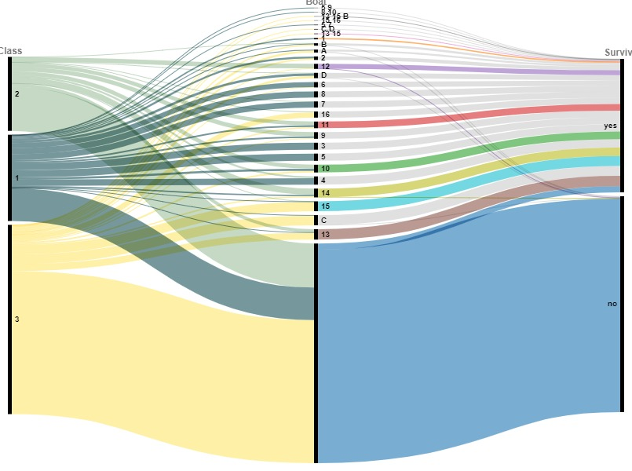

### RawGraph Exercise

In this exercise, I used the Alluvial Diagram in RawGraph to provide insight into who survived the Titanic disaster and who didn't.

[Data Source](https://raw.githubusercontent.com/rawgraphs/rawgraphs-core/master/data/titanic.tsv)  
 

⬅️[Back to Portfolio ](README.md)  

